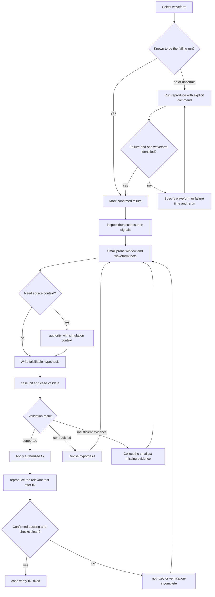

# systemverilog-waveform-debug-skill

[](https://github.com/L1Ban404/systemverilog-waveform-debug-skill/actions/workflows/smoke.yml)

A Codex skill and portable CLI for evidence-driven Verilog/SystemVerilog debugging from VCD or FST waveforms.

Version 0.6 turns waveform analysis into an iterative investigation: discover hierarchy and signals, query compact windows, compare good and bad traces, map activity to RTL ownership, test hypotheses, and close the loop with an authorized RTL fix and regression.

## Capabilities

- Pure Python 3.10+ streaming VCD metadata and change queries
- FST through compatible `pywellen` or cached `fst2vcd` conversion
- Waveform-only scope, signal, point, and bounded-window queries
- Physical time units, phase-limited clock-edge samples, and four-state-safe radix display
- Good/bad trace first-divergence analysis
- Verilog/SystemVerilog discovery plus `.f/.flist`, include, define, and exclude inputs
- RTL hierarchy authority and source-navigation context
- Portable simulation provenance manifests and reviewable Markdown evidence reports
- Immutable debug cases with deterministic hypothesis validation and evidence packets
- Explicit reproduction runs, confirmed failure provenance, and fix verification reports
- Bounded JSON evidence designed for an LLM context window

The adapter is simulator- and architecture-independent.

## Install as a project skill

```bash
git submodule add https://github.com/L1Ban404/systemverilog-waveform-debug-skill.git \
  .codex/skills/systemverilog-waveform-debug-skill
```

SSH works as well:

```bash
git submodule add git@github.com:L1Ban404/systemverilog-waveform-debug-skill.git \
  .codex/skills/systemverilog-waveform-debug-skill
```

## Quick start

```bash
CLI=.codex/skills/systemverilog-waveform-debug-skill/scripts/wave_debug.py

python "$CLI" doctor
python "$CLI" inspect --json
python "$CLI" scopes --json
python "$CLI" signals --scope tb.dut --match valid --json
python "$CLI" probe --around 420ns --radius 30ns \
  --scope tb.dut --signal tb.dut.clk --clock tb.dut.clk \
  --format table --view snapshots
```

## Recommended debug flow

Treat a debug session as an evidence chain, not as a search for a plausible RTL explanation. The normal order is **confirm the failing waveform → observe → infer → state a falsifiable hypothesis → validate → reproduce after the fix**.



The diagram is deliberately strict: an unconfirmed waveform is still usable for exploratory `probe`, `scopes`, and `signals`, but it cannot support a “current failure” conclusion, `case init`, or fix verification.

1. **Get the right waveform and record its status.** If the current waveform is already known to come from the failing run, analyse it directly and pass `--confirm-failure` when creating a case. If that relationship is uncertain, re-run the failure first with an explicit command:

   ```bash
   python "$CLI" reproduce --run-command '<simulation command>' \
     --testcase '<testcase-if-applicable>' --results <results-xml> \
     --waveform <expected-waveform-output> --out build/wave-debug/runs/<run-id>/manifest.json
   ```

   A non-zero simulation exit status or a JUnit failure records `confirmed-failure`. When no waveform path is supplied, `reproduce` accepts only one newly created or modified waveform; otherwise it stops and asks for an explicit path. A time parsed from failure text is only a candidate—supply `--failure-time` if you want it recorded as the single failure time.

2. **Discover actual elaborated names before probing.** Start from the selected waveform and inspect the compact summary, then enumerate scopes and signals. Use the exact returned paths in later commands.

   ```bash
   python "$CLI" inspect --waveform <failing-waveform> --provenance-file <manifest> --json
   python "$CLI" scopes --waveform <failing-waveform> --json
   python "$CLI" signals --waveform <failing-waveform> --scope <actual-scope> --match <local-name-fragment> --json
   ```

   Use `inspect --verbose` only when the complete source and provenance records are needed. Do not guess a top-level instance name, generated path, or packed/array expansion.

3. **Collect a small window of waveform facts.** If the manifest has one confirmed failure time, use `--around-failure`; otherwise choose an explicit, narrow `--around` window. Prefer a clock snapshot view when following sequential logic.

   ```bash
   python "$CLI" probe --waveform <failing-waveform> --provenance-file <manifest> \
     --around-failure --radius <small-window> --scope <actual-scope> \
     --clock <actual-clock-path> --format table --view snapshots
   ```

   Record observations separately from interpretation: `Observed` is what the waveform contains; `Inferred` is an explanation; `Hypothesis` is a statement that can be disproved. Offline waveforms are `waveform-observed` only and cannot establish Active/NBA/Postponed ordering.

4. **Map to RTL only when source context is needed.** Build authority using the same filelist, include paths, defines, parameters, or provenance as the simulation. Treat `elaborated-exact`, `static-candidate`, and `heuristic-context` as mapping confidence, not root-cause conclusions.

   ```bash
   python "$CLI" authority --waveform <failing-waveform> \
     --filelist <simulation-filelist> --top <simulation-top>
   ```

5. **Turn an investigation into an auditable case.** Create a case only from a confirmed failing waveform, edit the generated hypotheses to use exact paths and limited predicates, then validate them. Validation writes revisions and evidence; it never rewrites the original case or invents a hypothesis.

   ```bash
   python "$CLI" case init --waveform <failing-waveform> --provenance-file <manifest> \
     --symptom '<externally observable failure>' --out build/wave-debug/cases/<case-id>/case.json
   python "$CLI" case validate --case build/wave-debug/cases/<case-id>/case.json \
     --report build/wave-debug/case-report.md
   ```

6. **Fix, then close the loop with a passing reproduction.** Run the same relevant test explicitly after the authorized code change. An existing test that failed before the change and passes after it is a valid regression; add a test only when coverage is missing. Finally, verify the original case against the confirmed-passing run:

   ```bash
   python "$CLI" reproduce --run-command '<simulation command after fix>' \
     --testcase '<testcase-if-applicable>' --results <results-xml> \
     --waveform <fixed-waveform> --out build/wave-debug/runs/<fixed-run-id>/manifest.json
   python "$CLI" case verify-fix --case <failing-case-or-revision> \
     --waveform <fixed-waveform> --verification-manifest build/wave-debug/runs/<fixed-run-id>/manifest.json \
     --outcome fixed --report build/wave-debug/fix-report.md
   ```

   `case verify-fix` reports `fixed` only when the verification run is confirmed passing, JUnit has no failures, and the original case checks no longer trigger a falsifier. Otherwise it reports `not-fixed` or `verification-incomplete` rather than declaring success.

Waveform auto-discovery is deliberately conservative: if more than one `.fst` or `.vcd` exists, `inspect` lists paths, sizes, and UTC modification times but does not select one. Other waveform-reading commands require `--waveform PATH` in that case. Re-run the failure first; never assume a pre-existing waveform belongs to that run.

Use `inspect --verbose` only when you need full source/provenance records; the default JSON is intentionally a compact waveform, hierarchy, role, and confirmation summary.

`--match` is a case-insensitive literal substring and repeated terms are ANDed. To match local-name alternatives, use `--name-regex '<alternative-1>|<alternative-2>'`; use `--path-regex` for full paths. Empty `scopes` and `signals` results include fuzzy hierarchy suggestions. `--top` is accepted by source/elaboration commands (`inspect`, `probe`, `packet`, `authority`), not `scopes` or `signals`, which always expose the waveform's real elaborated paths.

`probe --clock ...` returns waveform-observed clock-edge snapshots in JSON; `--format table --view snapshots` makes those rows directly readable. All timestamps in a probe use the waveform's declared timescale unit.

`probe --radix auto` preserves 1-bit four-state logic, uses hexadecimal for known buses, and falls back to exact `0b...` when a bus contains mixed `X/Z`; JSON always retains `value_bits`. Snapshot output is explicitly `waveform-observed`: offline VCD/FST does not identify Active, NBA, or Postponed event regions. Requests for those phases fail until the simulation supplies phase-aware instrumentation.

Signal filters are explicit: `--match` and `--name-regex` target local names, while `--path-match` and `--path-regex` target full hierarchy paths. Traversal is recursive by default; add `--no-recursive` to stay in the selected scope.

Record the run context alongside the waveform:

```bash
python "$CLI" provenance --waveform <waveform-from-failing-run> \
  --simulator <simulator> --simulation-command '<reproducible-command>' \
  --out build/wave-debug/provenance.json
```

Use `compare --align reset-deassert --align-signal <path>` or `--align clock-edge --align-signal <path>` when traces do not share a time origin. Add `--report evidence.md --inference '...' --hypothesis '...'` to `probe` for a compact Markdown evidence report.

## Debug cases

Use a case when an investigation needs multiple explicit, falsifiable hypotheses. Initialization freezes waveform provenance but creates an editable JSON file; validation never rewrites it and instead writes a new revision plus one bounded evidence packet per check.

```bash
python "$CLI" case init --waveform <waveform-from-failing-run> \
  --confirm-failure --symptom '<observable failure>' --out build/wave-debug/cases/<case-id>/case.json

# Add hypotheses to the generated JSON, then validate all or one selected id.
python "$CLI" case validate --case build/wave-debug/cases/<case-id>/case.json \
  --report build/wave-debug/case-report.md
```

The debug-case `1.0` predicate set is deliberately small: `value_at`, `stable`, `transition`, `edge`, and `occurs_before`. It accepts only exact elaborated paths and raw `0/1/x/z` bit strings. Results are `supported`, `contradicted`, or `insufficient-evidence`; the CLI does not generate, rank, or silently revise hypotheses. See [the case schema](schemas/debug_case.schema.json) for the JSON contract.

## Reproduce and verify a fix

Run a simulation only through an explicit command. The command's stdout/stderr, exit status, optional JUnit/XML result, changed waveform, and source context are archived into a manifest. A successful command is only a confirmed passing verification when JUnit reports no failures or `--confirm-passing` is explicit.

```bash
python "$CLI" reproduce --run-command '<simulation command>' \
  --waveform <expected-waveform-output> --results <results-xml> \
  --out build/wave-debug/runs/<run-id>/manifest.json
```

Pass `--confirm-failure` when a manually selected waveform is known to be the failing run. `case init` requires this confirmation or a matching manifest with `confirmed-failure`; ordinary `probe`, `signals`, and `scopes` remain available for any explicit waveform. `probe --around-failure --provenance-file <manifest>` works only with a confirmed failure that has one explicit failure time.

After a fix, verify the original case against a waveform from a confirmed-passing reproduction:

```bash
python "$CLI" case verify-fix --case <failing-case-or-revision> \
  --waveform <verification-waveform> --verification-manifest <run-manifest> \
  --outcome fixed --report build/wave-debug/fix-report.md
```

The report records before/after check evidence, command exit status, testcase, and JUnit result. A targeted test that fails before the change and passes after it is already a valid regression; add a new testcase only when existing coverage does not exercise the behavior.

Map selected activity back to RTL:

```bash
python "$CLI" authority --waveform build/fail.fst \
  --filelist sim/files.f --top tb_top --authority-backend auto
python "$CLI" probe --waveform build/fail.fst --around 420ns --radius 20ns \
  --scope tb_top.dut --match state --filelist sim/files.f --top tb_top
```

Compare traces:

```bash
python "$CLI" compare passing.vcd failing.vcd --scope tb.dut
```

Run `python "$CLI" <command> --help` for all options. Times accept integer waveform ticks or physical values such as `42ns` and `1.5us`.

## Backends

VCD requires only Python 3.10 or newer. FST uses the first available path:

1. the bundled BSD-3-Clause `pywellen` binary on compatible CPython 3.12 x86-64 Linux systems;
2. a compatible installed `pywellen` on other platforms;
3. `fst2vcd`, commonly provided by GTKWave or OSS CAD Suite.

`doctor --json` reports backend provenance, runtime ABI, capabilities, and remediation. RTL authority defaults to `auto`: it uses Verilator's elaborated JSON when the installed Verilator supports `--json-only`, labeling the result `exact` with high confidence. Pass the simulation's `--filelist`, `--include`, `--define`, and `--parameter NAME=VALUE` inputs (or `--provenance-file`) so elaboration has the same context. Use `--authority-backend static` for the internal no-dependency fallback; it is labeled `static-source-match` and is useful for ownership candidates, but not equivalent to compiler elaboration for complex generate, interface, package, or preprocessor-heavy designs. Probe mappings additionally normalize these states as `elaborated-exact`, `static-candidate`, or `heuristic-context`. An explicit `--authority-backend verilator` never silently falls back.

### Recommended: install Verilator locally

For parameterized, macro-heavy, or generate-heavy RTL, install a recent local Verilator so `authority --authority-backend auto` can produce compiler-elaborated `exact` mappings. Verify that the installed version exposes the required JSON interface:

```bash
verilator --version
verilator --help | grep -- --json-only
python "$CLI" doctor --json
```

On Debian/Ubuntu, `sudo apt install verilator` is a convenient starting point; use a newer upstream or OSS CAD Suite build when the packaged version does not list `--json-only`. The tool continues to work without Verilator through `--authority-backend static`.

The bundled `pywellen` component is distributed under BSD-3-Clause; see `third_party/pywellen/LICENSE`.

Authority JSON and SQLite metadata use the same `0.4` schema version. The JSON contract is published in `schemas/authority.schema.json`; consumers should reject unsupported versions instead of guessing field semantics. Authority files and cache metadata are written atomically, while cache identity includes the selected backend, sources, include paths, and definitions.

## Versions

Tool version `0.6.0` is separate from persisted contracts: waveform evidence and authority remain `0.4`, provenance is `1.0`, and debug cases are `1.0`. JSON command responses include `tool_version` and `contract_schema`; `doctor --json` publishes the complete registry.

## Development

```bash
python -m unittest discover -s tests -p 'test_*.py'
python tests/test_smoke.py
python -m py_compile scripts/wave_debug.py scripts/wave_debug_lib/*.py
python -m pip install -r requirements-dev.txt
python tests/validate_skill.py
```

CI checks the portable VCD path on Python 3.10–3.13 and exercises both direct and converted FST paths on Python 3.12.

## License

Apache-2.0. See [LICENSE](LICENSE).
